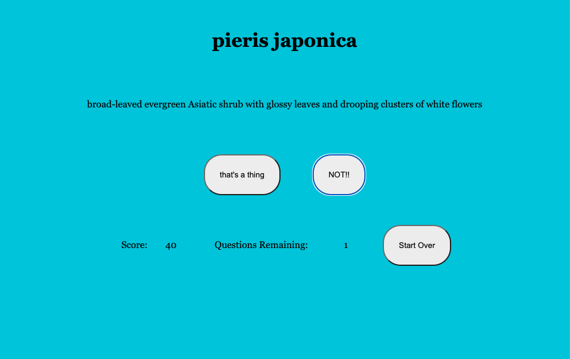

That's a THING??
--

A simple webgame that challenges the user's knowledge of the English language.

--

Technologies used
--

* HTML 5
* CSS3
* Javascript
* Jquery
* Words API

Screenshot
--

--
Getting Started
--

You must decide if this mysterious collection of English characters are real.. or pure nonese! [Click Here](https://caseyvoss95.github.io/THATS-a-word/) to play deployed game.

Future Enhancements
--
* Add a more distinctive style.
* Animate the user interface.
* Add sound effects on button clicks.
* Add picture database that displays words after guess is made.
* Add additional gameplay style(s).
